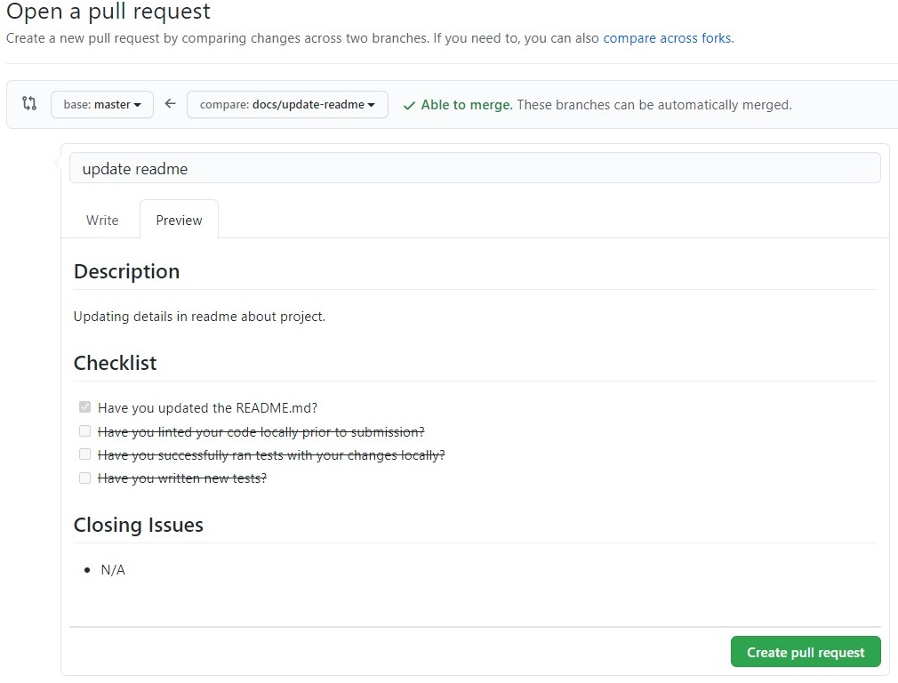
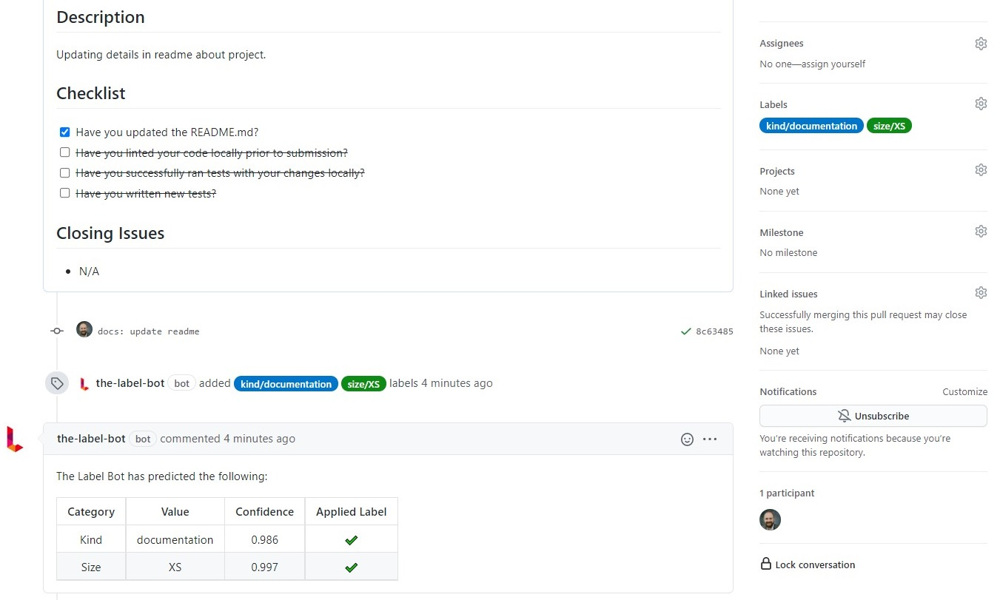

# Label Bot

The Label Bot helps your team by automatically labelling your Pull Requests by kind and size using AI.

It will nudge your contributors to create better PRs.

And you can extend your workflow using these new labels!

---

**Size** will be classified as one of:
XS, S, M, L or XL or XXL.

**Kind** will be classified as one of: feature, bug or documentation

## Have an idea or a problem?

[Raise an issue](https://github.com/review-bots/label-bot/issues/new)

## Usage

### 1. Install

https://github.com/marketplace/label-bot

### 2. Create a PR

  

### 3. Watch for feedback! :tada:

### 4. Update your PR

When you change the PR, the `kind` and `size` will be recalculated.

If either changes, the label will be updated and the comment will be updated on the PR.

## Bonus: Extend your existing workflow

Use the labels to automatically take actions and make contributing awesome.

###  Examples

1. Automatically Merge a PR when it's labelled.

    https://github.com/review-bots/merge-pr-example

1. Automatically Close a PR when it's labelled.

    https://github.com/review-bots/close-pr-example

## Plans

1. Open Source

    - Unlimited Public Repositories
